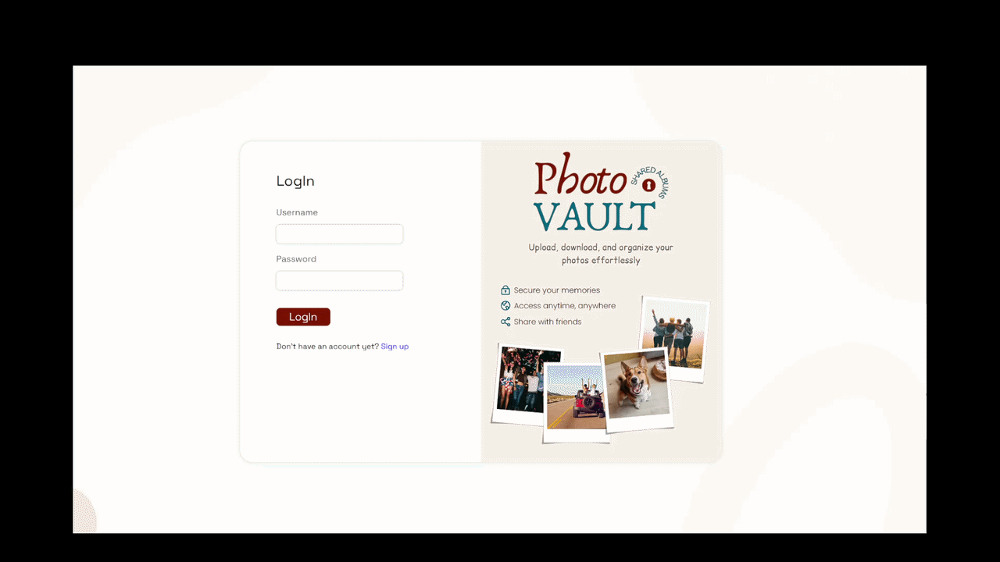

# 📸 PhotoVault

A photo-sharing web application built for friends to upload, organize, and share memories in one place.  

PhotoVault allows users to create albums, upload photos, and collaborate with others by sharing access to albums. Whether it’s a trip, event, or casual hangout, everyone can contribute their photos to a shared space.

> ⚠️ **Status:** This project is a work in progress. Backend is ~90% complete, and the frontend currently includes the authentication page. The dashboard and remaining UI features are still under development.

---

## 📦 Technologies

- Vue.js
- Laravel
- PHP
- JavaScript
- HTML
- CSS
- AWS S3
- MySQL

---

## 🦄 Features

Here are the planned features for PhotoVault:

### 🔐 Authentication
- Register a new account
- Log in and log out securely
- Token-based authentication using Laravel Sanctum

### 📁 Albums (Boards)
- Create albums to organize photos
- Delete albums (only by the owner)
- View all albums you have access to
- Share albums with other users

### 📸 Photos
- Upload photos (.jpg, .png) to albums
- Download photos
- Delete photos you uploaded

### 👥 Collaboration
- Shared albums allow multiple users to:
  - Upload photos
  - Download photos
  - View shared content

### 🔍 Filtering & Sorting
- Filter photos by uploader
- Sort photos (newest ↔ oldest)
- Select multiple photos

---

## 👩🏽‍🍳 The Process

I started this project by defining clear requirements in the form of user stories. This helped me understand the core functionality and prioritize features.

Next, I sketched the dashboard layout on a whiteboard to visualize the user experience. After that, I moved into Figma to create a low-fidelity prototype of the dashboard and authentication pages. Once the structure felt right, I designed a high-fidelity version of the login page.

With the designs ready, I shifted focus to the backend. I implemented most of the core functionality using Laravel, including authentication, album management, photo handling, and AWS S3 integration.

After completing the majority of the backend, I started working on the frontend, beginning with the authentication page, which is now fully functional.

The dashboard and main user interface are currently under development.

---

## 🎬 Demo

Here’s a short preview of the authentication page:



---

## 📚 What I Learned

### ☁️ Working with AWS S3
- Learned how to store and retrieve files securely using S3
- Implemented temporary URLs for secure, time-limited access to photos

### 🔐 Authentication & Security
- Gained experience with token-based authentication using Laravel Sanctum
- Improved understanding of request validation and authorization policies

### 🧠 Backend Architecture
- Structured a Laravel application using controllers, models, and policies
- Designed scalable endpoints for handling albums and photos
- Implemented access control for shared resources

### 📸 File Handling
- Managed file uploads, validation, and storage
- Generated unique file paths and handled metadata storage in the database

### 🎨 UI/UX Design Process
- Practiced designing in Figma from low-fi to high-fi
- Learned how planning UI early improves development speed and clarity

---

## 💭 How can it be improved?

- Build and finalize the dashboard UI
- Improve photo filtering and sorting capabilities
- Add drag-and-drop functionality for uploads
- Enhance sharing system (e.g., permissions/roles)
- Optimize performance for large albums

---

## 🚦 Running the Project

To run the project locally, follow these steps:

---

### 🔧 Backend (Laravel)

1. Clone the repository

2. Navigate to the backend directory

3. Install dependencies:
   ```bash
   composer install
   ```

4. Create a `.env` file:
   ```bash
   cp .env.example .env
   ```

5. Configure your database in `.env`:
   ```env
   DB_CONNECTION=mysql
   DB_HOST=127.0.0.1
   DB_PORT=3306
   DB_DATABASE=photovault
   DB_USERNAME=root
   DB_PASSWORD=
   ```

6. Make sure your MySQL server is running  

7. Create the database manually  
   - Use phpMyAdmin or MySQL CLI to create:
   ```
   photovault
   ```

8. Run migrations:
   ```bash
   php artisan migrate
   ```

9. Start the Laravel development server:
   ```bash
   php artisan serve
   ```

---

### ☁️ AWS Configuration (Required)

This project uses AWS S3 for photo storage.

Add the following to your \`.env\` file:

```env
AWS_ACCESS_KEY_ID=your_key
AWS_SECRET_ACCESS_KEY=your_secret
AWS_DEFAULT_REGION=your_region
AWS_BUCKET=your_bucket_name
```

Without this configuration, uploading and viewing photos will not work.

---

### 🎨 Frontend (Vue)

1. Navigate to the frontend directory

2. Install dependencies:
   ```bash
   npm install
   ```

3. Start the development server:
   ```bash
   npm run dev
   ```

4. Open the app in your browser:
   ```
   http://localhost:xxxx
   ```
   
